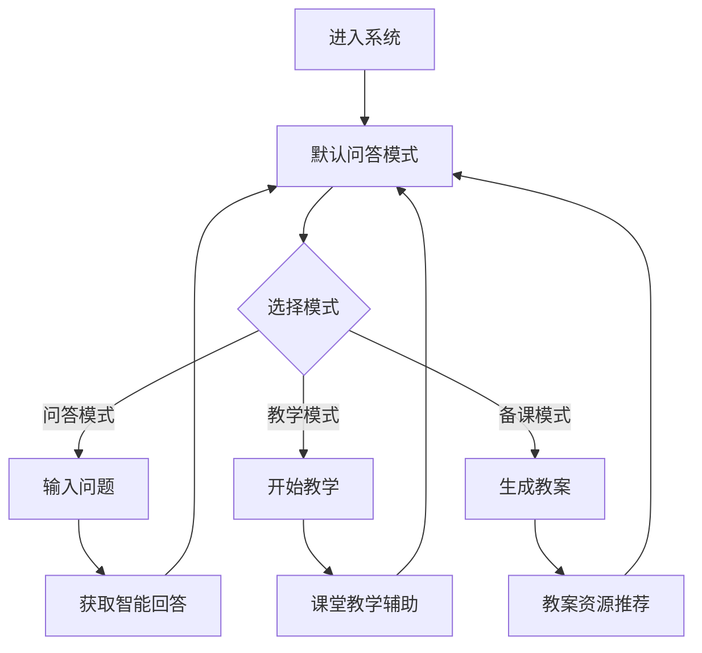

## 1. 产品概述
乡村老师助教系统是一个面向乡村教师的智能教育助手，提供课堂教学辅助、学生问答和备课支持等功能。
- 主要解决乡村教师教学资源不足、课堂互动单一、备课时间紧张等问题，目标用户为乡村教师和小学生。
- 产品价值在于通过AI技术提升乡村教育质量，缩小城乡教育差距，为乡村教师提供智能化教学工具。

## 2. 核心功能

### 2.1 用户角色
| 角色 | 注册方式 | 核心权限 |
|------|---------------------|------------------|
| 乡村教师 | 无需注册，直接使用 | 使用所有教学辅助功能 |
| 学生 | 无需注册，课堂参与 | 参与课堂互动，提交问题 |

### 2.2 功能模块
1. **主界面**：品牌区域、模式切换、聊天对话区、输入区
2. **问答模式**：智能问答、学生问题识别、引导式回答
3. **教学模式**：知识讲解、课堂教学、互动引导
4. **备课模式**：教案生成、资源推荐、教学计划

### 2.3 页面详情
| 页面名称 | 模块名称 | 功能描述 |
|-----------|-------------|---------------------|
| 主界面 | 品牌区域 | 显示系统名称、副标题和现代化教育图标，体现科技感和教育属性 |
| 主界面 | 模式切换 | 提供问答模式、教学模式、备课模式三个切换按钮，具有清晰的选中态和悬停效果 |
| 主界面 | 聊天对话区 | 展示师生对话内容，支持多轮对话，包含系统消息和用户消息，突出显示重点内容 |
| 主界面 | 高亮回答卡片 | 显示当前聚焦的问题或回答，具有科技感的高亮效果和动态视觉反馈 |
| 主界面 | 输入区 | 提供文本输入框、语音输入按钮和发送按钮，支持快捷输入和语音识别 |

## 3. 核心流程
用户打开系统后，默认进入问答模式，可以通过模式切换按钮切换到教学模式或备课模式。在问答模式下，用户可以输入问题获得智能回答；在教学模式下，系统提供课堂教学辅助；在备课模式下，系统帮助生成教案和教学资源。

## 4. 用户界面设计
### 4.1 设计风格
- 主色调：科技蓝 (#165DFF)、靛蓝 (#4F46E5)、紫色 (#7C3AED) 渐变
- 辅助色：青蓝 (#06B6D4)、淡紫 (#C4B5FD)、白色 (#FFFFFF)、珊瑚橙 (#F97316)（用于按钮强调）
- 按钮风格：圆角矩形，具有玻璃拟态效果和微发光边缘
- 字体：中文使用思源黑体，标题 20-24px，正文 14-16px
- 布局风格：卡片式布局，顶部导航，中央内容区，底部输入区
- 图标风格：线性科技风格图标，简洁现代

### 4.2 页面设计概览
| 页面名称 | 模块名称 | UI元素 |
|-----------|-------------|-------------|
| 主界面 | 品牌区域 | 渐变背景，现代化教育图标，系统标题使用渐变文字效果，副标题使用轻量级文字 |
| 主界面 | 模式切换 | 三个并排的圆角矩形按钮，选中状态使用主色调渐变，未选中状态使用玻璃拟态效果，悬停时有微动画 |
| 主界面 | 聊天对话区 | 气泡式对话，系统消息使用白色卡片，用户消息使用主色调渐变，消息带有时间戳和头像 |
| 主界面 | 高亮回答卡片 | 蓝色渐变背景，发光边缘，动态脉冲效果，显示当前聚焦的问题和智能标签 |
| 主界面 | 输入区 | 圆角矩形输入框，左侧语音按钮，右侧渐变发送按钮，输入框聚焦时有发光效果 |

### 4.3 响应性
- 桌面优先设计，适配1200px以上屏幕
- 平板适配：768px-1199px，模式切换按钮垂直排列
- 移动端适配：767px以下，简化布局，保持核心功能
- 触摸优化：按钮尺寸适合触摸操作，交互区域足够大

### 4.4 3D场景引导（可选）
- 环境：柔和的科技感背景，淡蓝色调
- 照明：柔和的漫反射光，突出界面元素
- 相机：固定视角，聚焦于中央内容区
- 构图：居中布局，层次分明
- 交互：微妙的悬停效果和过渡动画
- 后处理：轻微的高斯模糊和发光效果