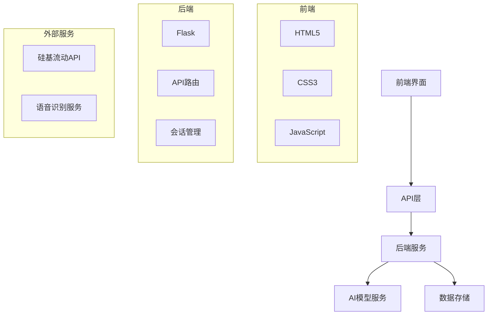
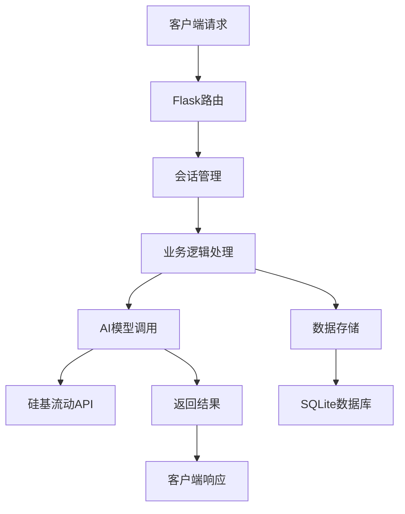
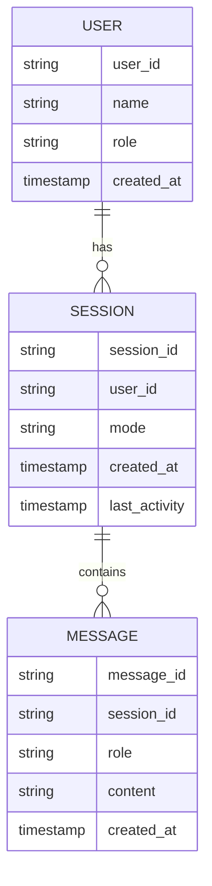

## 1. 架构设计


## 2. 技术描述
- 前端：HTML5 + CSS3 + JavaScript
- 初始化工具：无需特殊初始化，直接修改现有文件
- 后端：Flask@2.0 + Python@3.11
- 数据库：SQLite（轻量级本地存储）
- AI服务：硅基流动API（deepseek-ai/DeepSeek-V3.2）

## 3. 路由定义
| 路由 | 用途 |
|-------|---------|
| / | 主界面 |
| /api/chat/ | 聊天接口 |
| /api/chat/session | 会话创建接口 |
| /api/chat/teaching | 教学模式接口 |
| /api/lesson/ | 教案生成接口 |
| /api/voice/input | 语音输入接口 |

## 4. API定义
### 4.1 聊天接口
- 请求方法：POST
- 路径：/api/chat/
- 请求体：
```json
{
  "session_id": "string",
  "text": "string"
}
```
- 响应：
```json
{
  "type": "normal",
  "response": {
    "text": "string",
    "session_id": "string"
  }
}
```

### 4.2 会话创建接口
- 请求方法：POST
- 路径：/api/chat/session
- 请求体：
```json
{
  "user_id": "string"
}
```
- 响应：
```json
{
  "session_id": "string"
}
```

### 4.3 教学模式接口
- 请求方法：POST
- 路径：/api/chat/teaching
- 请求体：
```json
{
  "session_id": "string",
  "topic": "string",
  "outline": ["string"]
}
```
- 响应：
```json
{
  "intro": "string",
  "response": {
    "text": "string",
    "session_id": "string"
  },
  "outline": ["string"]
}
```

### 4.4 教案生成接口
- 请求方法：POST
- 路径：/api/lesson/
- 请求体：
```json
{
  "grade": "number",
  "subject": "string",
  "topic": "string",
  "duration": "string"
}
```
- 响应：
```json
{
  "success": "boolean",
  "plan": {
    "教学目标": "object",
    "教学重点": "string",
    "教学难点": "string",
    "教学方法": "string",
    "教学准备": "string",
    "教学过程": "array",
    "板书设计": "string",
    "作业设计": "string",
    "教学反思": "string"
  }
}
```

## 5. 服务器架构图


## 6. 数据模型
### 6.1 数据模型定义


### 6.2 数据定义语言
```sql
-- 用户表
CREATE TABLE IF NOT EXISTS users (
    user_id TEXT PRIMARY KEY,
    name TEXT NOT NULL,
    role TEXT NOT NULL DEFAULT 'teacher',
    created_at TIMESTAMP DEFAULT CURRENT_TIMESTAMP
);

-- 会话表
CREATE TABLE IF NOT EXISTS sessions (
    session_id TEXT PRIMARY KEY,
    user_id TEXT NOT NULL,
    mode TEXT NOT NULL DEFAULT 'chat',
    created_at TIMESTAMP DEFAULT CURRENT_TIMESTAMP,
    last_activity TIMESTAMP DEFAULT CURRENT_TIMESTAMP,
    FOREIGN KEY (user_id) REFERENCES users(user_id)
);

-- 消息表
CREATE TABLE IF NOT EXISTS messages (
    message_id TEXT PRIMARY KEY,
    session_id TEXT NOT NULL,
    role TEXT NOT NULL,
    content TEXT NOT NULL,
    created_at TIMESTAMP DEFAULT CURRENT_TIMESTAMP,
    FOREIGN KEY (session_id) REFERENCES sessions(session_id)
);

-- 索引
CREATE INDEX IF NOT EXISTS idx_sessions_user_id ON sessions(user_id);
CREATE INDEX IF NOT EXISTS idx_messages_session_id ON messages(session_id);
```